# COMPLETE SYSTEM ARCHITECTURE & UML DESIGN SPECIFICATION
## AI-Based Smart Traffic Monitoring & Dynamic Adaptive Signal Control System
### Major Project Technical Reference & Architecture Document

---

## 📑 Table of Contents
1. [System Overview & Architecture Principles](#1-system-overview--architecture-principles)
2. [Multi-Tier System Architecture Diagram](#2-multi-tier-system-architecture-diagram)
3. [UML Class Diagram](#3-uml-class-diagram)
4. [UML Use Case Diagram](#4-uml-use-case-diagram)
5. [UML Sequence Diagrams](#5-uml-sequence-diagrams)
   - 5.1 [Sequence 1: Real-Time Perception & Adaptive Signal Control](#51-sequence-1-real-time-perception--adaptive-signal-control)
   - 5.2 [Sequence 2: Emergency Vehicle Green-Wave Preemption](#52-sequence-2-emergency-vehicle-green-wave-preemption)
   - 5.3 [Sequence 3: Traffic Violation Detection & Evidence Logging](#53-sequence-3-traffic-violation-detection--evidence-logging)
6. [UML State Machine Diagram (Finite State Machine)](#6-uml-state-machine-diagram)
7. [UML Activity Diagram (Frame Execution Pipeline)](#7-uml-activity-diagram)
8. [UML Component Diagram](#8-uml-component-diagram)
9. [UML Deployment Diagram](#9-uml-deployment-diagram)
10. [Data Flow Diagrams (DFD Level 0, 1 & 2)](#10-data-flow-diagrams)
11. [Data Models & Schema Specifications](#11-data-models--schema-specifications)
12. [Mathematical Algorithms & Control Formulas](#12-mathematical-algorithms--control-formulas)

---

## 1. System Overview & Architecture Principles

The **AI-Based Smart Traffic Monitoring and Dynamic Adaptive Signal Control System** is architected on high-throughput, edge-capable computer vision and decoupled finite state control.

### Core Architectural Patterns:
- **Pipes-and-Filters Pattern:** Successive processing stages (Frame Ingestion $\to$ Background Subtraction $\to$ Contour Classification $\to$ Centroid Association $\to$ Kinematics $\to$ Signal Allocation).
- **Observer / Pub-Sub Telemetry:** The backend streaming thread publishes live state dictionaries consumed asynchronously by the web dashboard over HTTP REST polling and MJPEG multipart streaming.
- **Hierarchical Finite State Machine (FSM):** Deterministic state transitions handling green allocations, yellow clearances, and instantaneous asynchronous emergency preemption interruptions.

---

## 2. Multi-Tier System Architecture Diagram

```mermaid
flowchart TD
    subgraph LAYER_1["1. INGESTION LAYER (Video Sources)"]
        CAM1["CCTV IP Camera 1\n(RTSP / H.264)"]
        CAM2["CCTV IP Camera 2\n(RTSP / H.264)"]
        SYNTH["Synthetic Traffic\nSimulator Engine"]
        UPLOAD["User MP4 Video\nUpload Module"]
    end

    subgraph LAYER_2["2. COMPUTER VISION & PERCEPTION LAYER"]
        MOG["MOG2 Background\nSubtraction Engine"]
        MORPH["Morphological Opening\n& Closing Filters"]
        CONTOUR["Contour Extraction &\nGeometry Filter"]
        EMG_SPEC["Emergency Beacon\nColorimetric Spectrogram"]
        CLASSIFIER["PCE Vehicle Classifier\n(Car, Bus, Truck, Bike, Ambulance)"]
    end

    subgraph LAYER_3["3. TRACKING & KINEMATICS LAYER"]
        EUCLID["Centroid Euclidean\nDistance Matcher"]
        ID_REG["Persistent Vehicle\nID Registry"]
        TRAJ["Trajectory &\nHeading Vector Estimator"]
        SPEED_EST["Kalman-Smoothed\nSpeed Calculator (km/h)"]
    end

    subgraph LAYER_4["4. DECISION & ADAPTIVE CONTROL LAYER"]
        DENSITY["PCE Lane Congestion\nWeighting Engine"]
        DATSA["D-ATSA Webster-Based\nAdaptive Timing Controller"]
        PREEMPT["Emergency Preemption\nGreen-Wave FSM"]
        AUDITOR["Traffic Violation &\nSafety Auditor"]
    end

    subgraph LAYER_5["5. PRESENTATION & AUDITING LAYER"]
        FLASK["Flask REST & Streaming Server\n(Port 5000)"]
        STREAM["MJPEG Annotated\nVideo Stream"]
        DASH["Modern Web Dashboard\n(HTML5 / CSS3 / JS)"]
        CHARTS["Real-Time Chart.js\nVisualizations"]
        CSV_STORE["CSV & Snapshot\nViolation Database"]
    end

    LAYER_1 --> LAYER_2
    LAYER_2 --> LAYER_3
    LAYER_3 --> LAYER_4
    LAYER_4 --> LAYER_5
```

---

## 3. UML Class Diagram

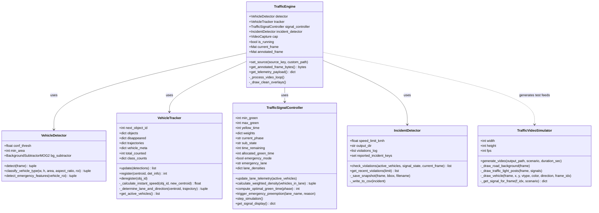

---

## 4. UML Use Case Diagram

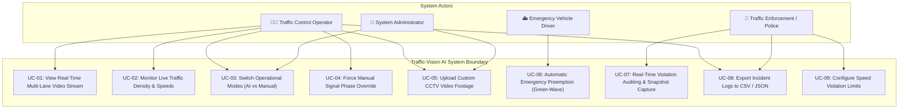

---

## 5. UML Sequence Diagrams

### 5.1 Sequence 1: Real-Time Perception & Adaptive Signal Control
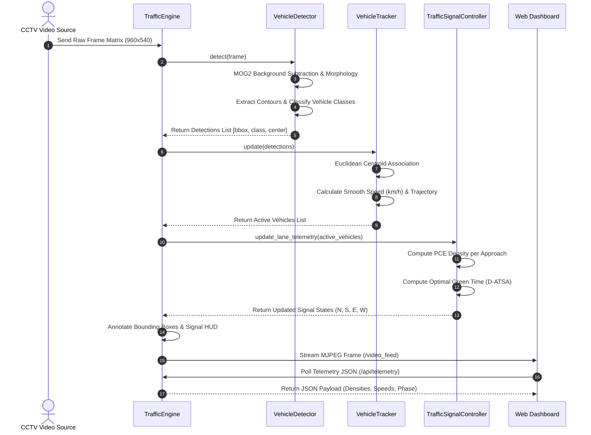

### 5.2 Sequence 2: Emergency Vehicle Green-Wave Preemption
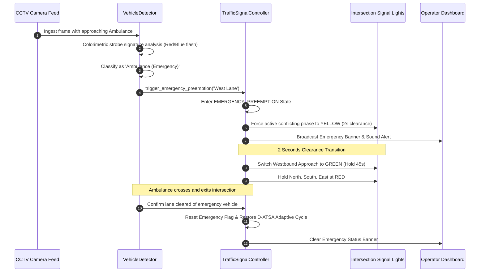

### 5.3 Sequence 3: Traffic Violation Detection & Evidence Logging
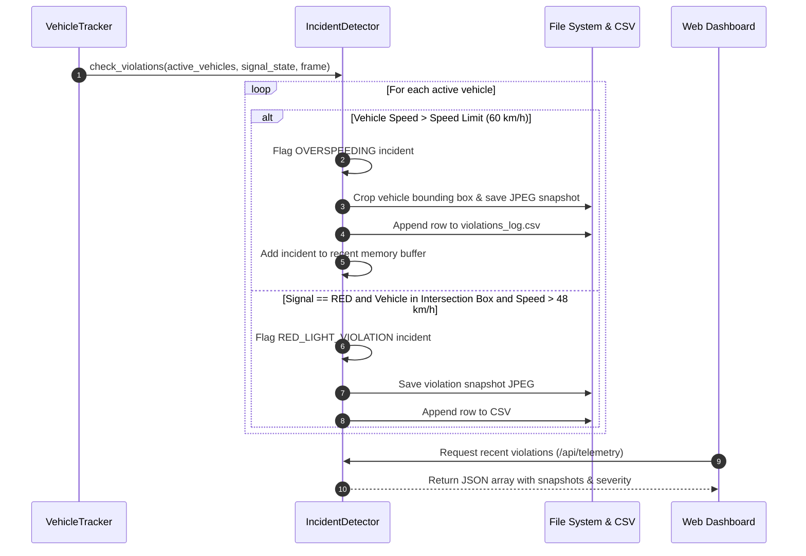

---

## 6. UML State Machine Diagram (Finite State Machine)

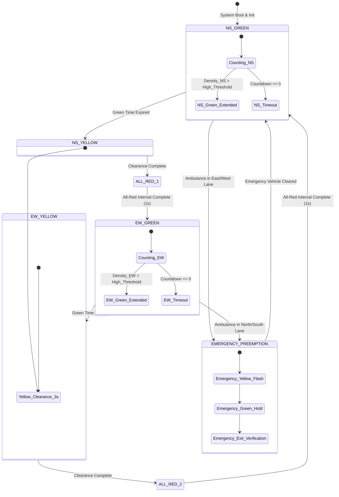

---

## 7. UML Activity Diagram (Frame Execution Pipeline)

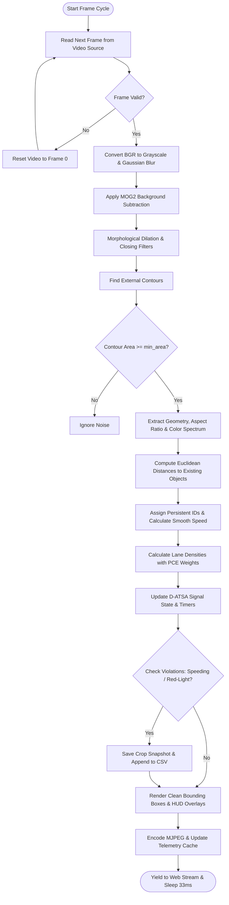

---

## 8. UML Component Diagram

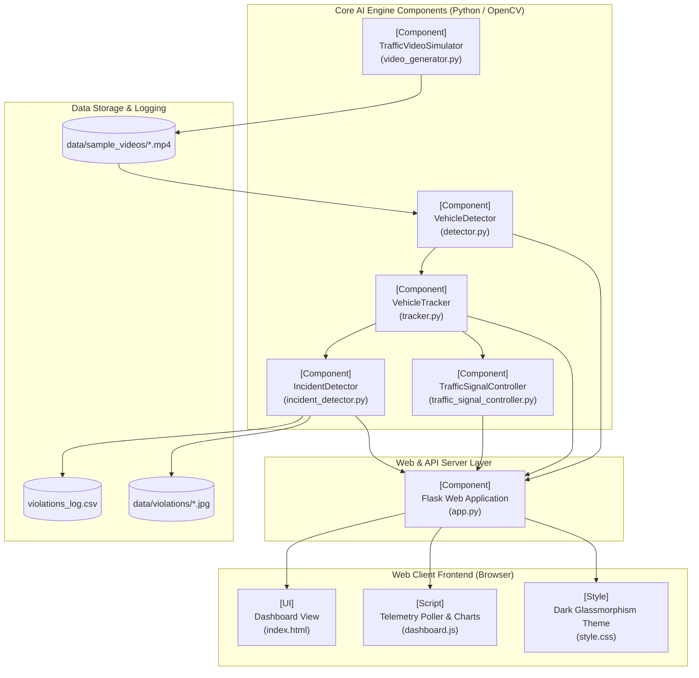

---

## 9. UML Deployment Diagram

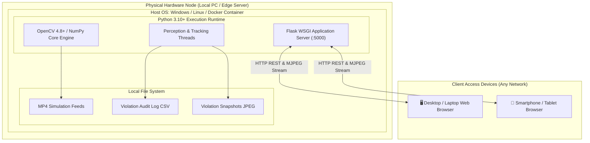

---

## 10. Data Flow Diagrams

### Data Flow Diagram (DFD Level 0 - Context Level)
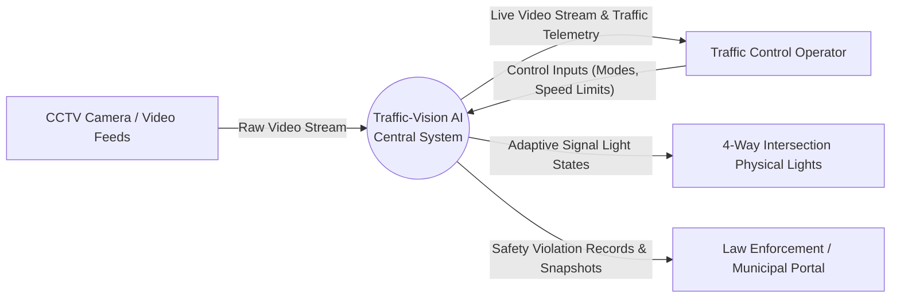

### Data Flow Diagram (DFD Level 1 - Subsystem Level)
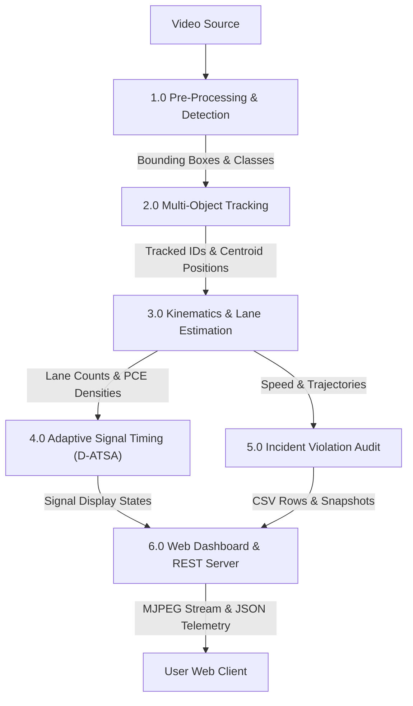

---

## 11. Data Models & Schema Specifications

### 11.1 Telemetry API Payload Schema (`/api/telemetry`)
```json
{
  "active_vehicle_count": 8,
  "cumulative_counted": 142,
  "class_breakdown": {
    "Car": 95,
    "Bus": 12,
    "Truck": 8,
    "Motorcycle": 24,
    "Ambulance": 3
  },
  "average_speed_kmh": 36.4,
  "congestion_index": 57,
  "current_source": "normal",
  "speed_limit": 60.0,
  "violations_count": 4,
  "signals": {
    "North": "GREEN",
    "South": "GREEN",
    "East": "RED",
    "West": "RED",
    "phase": "NS",
    "state": "GREEN",
    "countdown": 24,
    "allocated_green": 32,
    "emergency_mode": false,
    "emergency_lane": null,
    "co2_saved_kg": 0.48,
    "wait_time_saved_sec": 382,
    "lane_densities": {
      "North": 3.0,
      "South": 2.0,
      "East": 1.0,
      "West": 0.0
    }
  }
}
```

### 11.2 Violation Audit Record Schema (`violations_log.csv`)
| Field Name | Type | Description | Example |
| :--- | :--- | :--- | :--- |
| `Incident_ID` | String | Unique sequential incident code | `INC-0014` |
| `Timestamp` | DateTime | ISO Timestamp of occurrence | `2026-10-02 22:45:10` |
| `Vehicle_ID` | Integer | Persistent tracking object ID | `#48` |
| `Vehicle_Type` | String | Classified vehicle category | `Car` |
| `Speed_KMH` | Float | Calculated kinematic speed | `74.2` |
| `Speed_Limit` | Float | Configured urban speed limit | `60.0` |
| `Violation_Type` | String | Specific safety infraction | `Over-speeding` |
| `Lane` | String | Approach lane identifier | `North Approach` |
| `Snapshot_File` | String | Relative path to JPEG snapshot | `speed_viol_48.jpg` |

---

## 12. Mathematical Algorithms & Control Formulas

### 1. Passenger Car Equivalent (PCE) Lane Density:
$$\text{Density}_L = \sum_{i=1}^{N_L} W(v_i)$$

Where:
$$W(\text{Car}) = 1.0, \quad W(\text{Bus}) = 2.8, \quad W(\text{Truck}) = 2.5, \quad W(\text{Motorcycle}) = 0.5, \quad W(\text{Ambulance}) = 15.0$$

### 2. D-ATSA Dynamic Green Time Allocation:
$$G_{\text{allocated}} = \max\left(G_{\min}, \min\left(G_{\min} + \left(\frac{\text{Density}_{\text{Phase}}}{\text{Total Density} + \epsilon}\right) \cdot (G_{\max} - G_{\min}) \cdot 1.3, \; G_{\max}\right)\right)$$

Where:
- $G_{\min} = 12\text{ s}$ (Pedestrian clearance minimum boundary)
- $G_{\max} = 65\text{ s}$ (Starvation prevention maximum boundary)

### 3. Kinematic Speed Estimation:
$$v_{\text{inst}} = \left(\frac{\sqrt{(x_t - x_{t-1})^2 + (y_t - y_{t-1})^2}}{\Delta t}\right) \times C_{\text{speed}}$$
$$v_{\text{smooth}} = 0.82 \cdot v_{\text{prev}} + 0.18 \cdot v_{\text{inst}}$$

---

*Document Generated for AI-Based Smart Traffic Monitoring Major Project Submission.*
