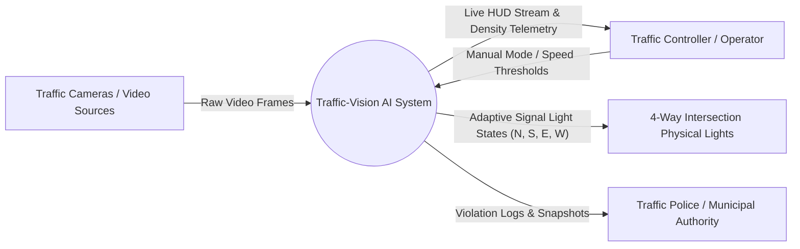
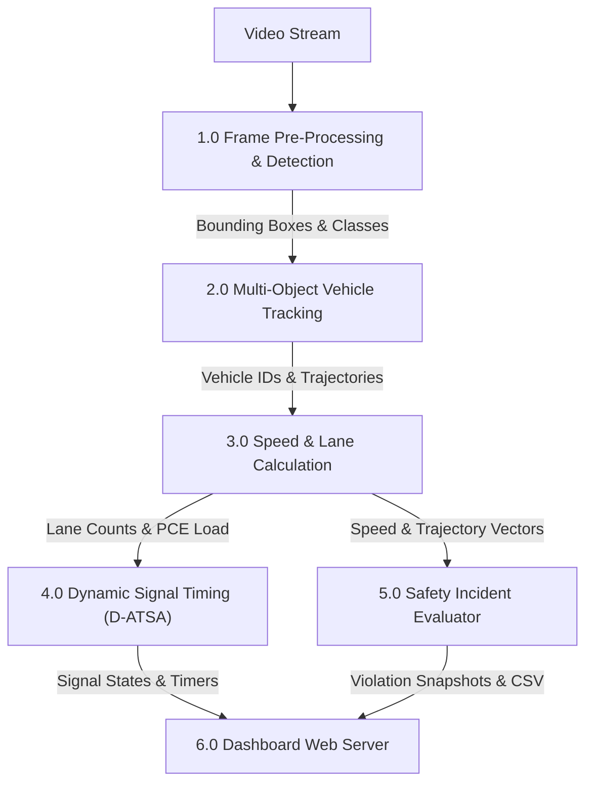
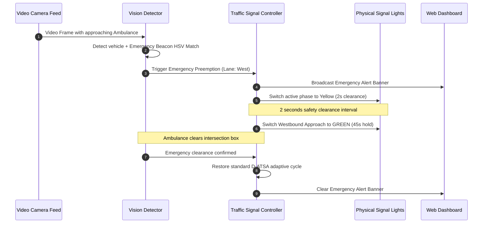
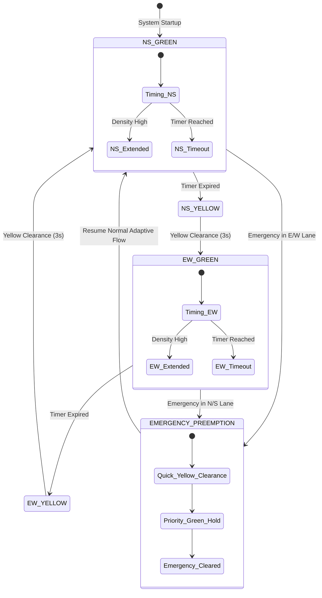

# SYSTEM ARCHITECTURE & DESIGN DIAGRAMS
## AI-BASED SMART TRAFFIC MONITORING & CONTROL SYSTEM

---

### 1. High-Level System Architecture Diagram

```mermaid
flowchart TD
    subgraph SENSING["1. Sensing & Ingestion Layer"]
        CAM1["HD CCTV Camera 1"]
        CAM2["HD CCTV Camera 2"]
        SIM["Synthetic Scenario Engine"]
        WEB["USB Webcam / RTSP Stream"]
    end

    subgraph PERCEPTION["2. AI Perception & Vision Engine"]
        MOG["MOG2 Background Subtraction & Blur"]
        MORPH["Morphological Dilation & Closing"]
        DET["Contour & Multi-Scale Classifier"]
        EMG["Emergency Siren & Beacon HSV Classifier"]
    end

    subgraph TRACKING["3. Multi-Object Tracking Engine"]
        CENTROID["Euclidean Centroid Tracker"]
        ID_MGR["Unique Vehicle ID Registry (#VID)"]
        SPEED["Kinematic Speed Estimator (km/h)"]
        LANE["Lane Mapping & Trajectory Tracing"]
    end

    subgraph DECISION["4. Adaptive Control & Incident Matrix"]
        PCE["PCE Weighted Density Calculator"]
        DATSA["D-ATSA Dynamic Green Time Engine"]
        PREEMPT["Emergency Green-Wave Preemption FSM"]
        INCIDENT["Safety Rule Auditor (Speed/Red/Wrong)"]
    end

    subgraph UI_LAYER["5. Operations & Visualization Dashboard"]
        STREAM["MJPEG Real-Time Video Stream"]
        SCHEMATIC["4-Way Animated LED Signal Display"]
        CHARTS["Live Chart.js Visualizations"]
        EXPORTS["CSV & JSON Audit Reports"]
    end

    SENSING --> PERCEPTION
    PERCEPTION --> TRACKING
    TRACKING --> DECISION
    DECISION --> UI_LAYER
```

---

### 2. Data Flow Diagram (DFD Level 0 - Context Level)

---

### 3. Data Flow Diagram (DFD Level 1 - Subsystems Level)

---

### 4. Sequence Diagram: Emergency Green-Wave Preemption Flow

---

### 5. Finite State Machine (FSM): Signal Controller State Transitions

